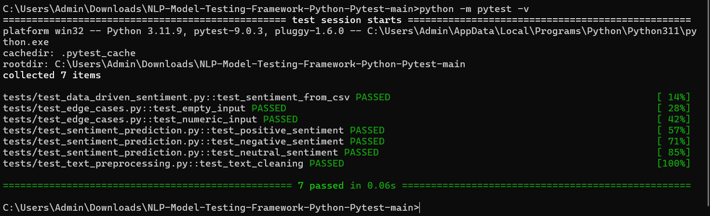

# 🧠 NLP Model Testing Framework (Python | Pytest | AI/ML QA)


---

## 🚀 Overview

This project is an **NLP Model Testing Framework** designed to validate machine learning model behavior using **Python and Pytest**.

Unlike traditional QA, this framework focuses on validating **model outputs**, ensuring predictions are:

- ✅ Accurate  
- 🔁 Consistent  
- ⚠️ Robust across edge cases  
- 🧠 Reliable for real-world usage  

It demonstrates how software testing evolves when working with **AI/ML systems**, where validating predictions is more critical than just testing functionality.

⚠️ Note:
This project uses a rule-based simulation to demonstrate AI testing concepts.
It is designed to showcase how QA validation works for AI systems such as LLMs and NLP models.

---

## 🔥 Key Features

- NLP Sentiment Model Testing  
- Text Preprocessing Validation  
- Data-driven Testing using CSV  
- Edge Case Handling (empty, numeric, mixed input)  
- Automated Test Execution using Pytest  
- Reusable Validation Logic  
- Scalable Test Design for ML systems  

## ⚠️ AI Risks Covered

- Hallucination
- Incorrect predictions
- Context loss
- Prompt variation inconsistency
- Unsafe responses

---

## 🛠 Tech Stack

- **Language:** Python  
- **Testing Framework:** Pytest  
- **Testing Approach:** Data-driven Testing  
- **Domain:** NLP (Sentiment Analysis)  
- **Concepts:** AI/ML Testing, Model Validation  

---

## 📁 Project Structure

```text
Project structure here

NLP-Model-Testing-Framework-Python-Pytest/

│
├── nlp_model/

    │ ├── __init__.py
    
    │ ├── sentiment_model.py
    
    │ └── text_preprocessor.py
│
├── tests/

    │ ├── __init__.py
    
    │ ├── test_sentiment_prediction.py
    
    │ ├── test_text_preprocessing.py
    
    │ ├── test_edge_cases.py
    
    │ └── test_data_driven_sentiment.py
│
├── test_data/

    │ └── sentiment_test_data.csv
│
├── screenshots/

    │ └── pytest-result.png
│
├── requirements.txt

└── README.md


---

## 🧪 Test Scenarios Covered

### 1️⃣ Sentiment Prediction Testing

```python
def test_positive_sentiment():
    assert predict_sentiment("I love this product") == "positive"

2️⃣ Text Preprocessing Validation
def test_text_cleaning():
    assert clean_text("HELLO!!!") == "hello"

3️⃣ Edge Case Testing
Empty input
Numeric input
Mixed-case input

4️⃣ Data-Driven Testing (CSV-Based)
text,expected_sentiment
I love this,positive
This is bad,negative

▶️ How to Run
pip install -r requirements.txt
python -m pytest -v

📊 Test Execution Output (Pytest)
7 passed in 0.06s

```

## 📸 Test Execution Screenshot



🌍 Real-World Relevance

In AI/ML systems, testing is not limited to functionality.

We need to validate:

Model prediction correctness

Input variability handling

Data-driven validation

Edge case robustness


This framework simulates real-world ML validation scenarios, bridging the gap between traditional QA and AI testing.

🎯 What This Project Demonstrates

NLP Model Testing Approach


AI/ML Validation Techniques


Data-driven QA Strategy


Edge Case Handling in AI Systems

Python + Pytest Automation Skills

🚀 Future Enhancements

Integration with real ML models (Scikit-learn / HuggingFace)

Model accuracy metrics validation

Confusion matrix validation

CI/CD integration using GitHub Actions

Prompt-based NLP testing


👩‍💻 Author

Pragya Kapil

QA Automation | AI Testing | GenAI | NLP Testing
