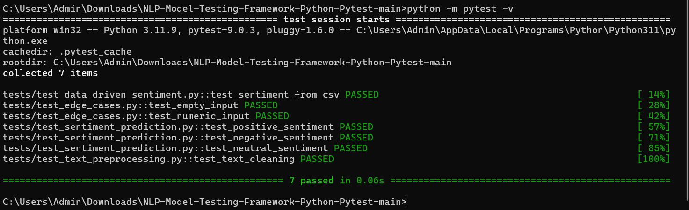

# 🧠 NLP Model Testing Framework (Python | Pytest | AI/ML QA)

[](https://github.com/Pragya-19/NLP-Model-Testing-Framework-Python-Pytest/actions/workflows/ci.yml)


---

## 🚀 Overview

This project is an **NLP Model Testing Framework** designed to validate machine learning model behavior using **Python and Pytest**.

Unlike traditional QA, this framework focuses on validating **model outputs**, ensuring predictions are:

- ✅ Accurate  
- 🔁 Consistent  
- ⚠️ Robust across edge cases  
- 🧠 Reliable for real-world usage  

It demonstrates how software testing evolves when working with **AI/ML systems**, where validating predictions is more critical than just testing functionality.

⚠️ Note:
This project uses a rule-based simulation to demonstrate AI testing concepts.
It is designed to showcase how QA validation works for AI systems such as LLMs and NLP models.

---

## 🔥 Key Features

- NLP Sentiment Model Testing  
- Text Preprocessing Validation  
- Data-driven Testing using CSV  
- Edge Case Handling (empty, numeric, mixed input)  
- Automated Test Execution using Pytest  
- Reusable Validation Logic  
- Scalable Test Design for ML systems  

## ⚠️ Validation Risks Covered

- Incorrect sentiment classification
- Prediction inconsistency against expected outputs
- Text preprocessing errors
- Empty-input handling
- Numeric-input handling
- Input-format variation
- Regression against golden test data

---

## 🛠 Tech Stack

- **Language:** Python  
- **Testing Framework:** Pytest  
- **Testing Approach:** Data-driven Testing  
- **Domain:** NLP (Sentiment Analysis)  
- **Concepts:** AI/ML Testing, Model Validation  

---

## 📁 Project Structure

```text
NLP-Model-Testing-Framework-Python-Pytest/
│
├── .github/
│   └── workflows/
│       └── ci.yml
│
├── nlp_model/
│   ├── __init__.py
│   ├── sentiment_model.py
│   └── text_preprocessor.py
│
├── tests/
│   ├── __init__.py
│   ├── test_sentiment_prediction.py
│   ├── test_text_preprocessing.py
│   ├── test_edge_cases.py
│   └── test_data_driven_sentiment.py
│
├── test_data/
│   └── sentiment_test_data.csv
│
├── screenshots/
│   └── pytest-result.png
│
├── requirements.txt
└── README.md
```

---

## 🧪 Test Scenarios Covered

### Sentiment Prediction Validation

The test suite validates positive, negative and neutral sentiment behavior.

```python
def test_positive_sentiment():
    result = predict_sentiment("I am very happy today")
    assert result == "positive"
```

### Text Preprocessing

Input normalization is validated before model-style processing.

```python
def test_text_cleaning():
    result = clean_text("Hello!!! How are you??")
    assert result == "hello how are you"
```

### Edge Cases

Coverage includes:

- Empty input
- Numeric input
- Positive text
- Negative text
- Neutral text

### Data-Driven Validation

Expected inputs and outputs are maintained in:

```text
test_data/sentiment_test_data.csv
```

Example:

```csv
text,expected_sentiment
I love this product,positive
This is bad service,negative
I am walking in park,neutral
```

This acts as a small **golden test dataset** for regression validation.

---

## ▶️ Running the Tests

```bash
pip install -r requirements.txt
python -m pytest -v
```

Current execution:

```text
7 passed
```

---

## 📸 Test Execution Evidence



🌍 Real-World Relevance

In AI/ML systems, testing is not limited to functionality.

We need to validate:

Model prediction correctness

Input variability handling

Data-driven validation

Edge case robustness


This framework simulates real-world ML validation scenarios, bridging the gap between traditional QA and AI testing.

🎯 What This Project Demonstrates

NLP Model Testing Approach


AI/ML Validation Techniques


Data-driven QA Strategy


Edge Case Handling in AI Systems

Python + Pytest Automation Skills

🚀 Future Enhancements

Integration with real ML models (Scikit-learn / HuggingFace)

Model accuracy metrics validation

Confusion matrix validation

CI/CD integration using GitHub Actions

Prompt-based NLP testing


👩‍💻 Author

Pragya Kapil

QA Automation | AI Testing | GenAI | NLP Testing
